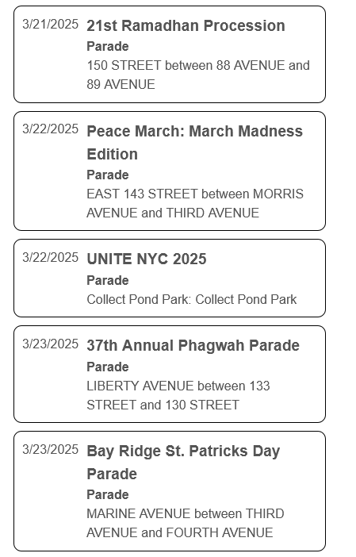

# NYC Parades

Using the [NYC Permitted Events data set](https://data.cityofnewyork.us/City-Government/NYC-Permitted-Event-Information/tvpp-9vvx), page should display what events currently have a permit set up.



***

## Motivation

I'm an avid street/documentary photographer that is usually roaming around the city in my free time with a camera. I'm not an event photographer, but the amount of events and parades that goes on in the city affords me opportunities to document energy and scenes I normally wouldn't get. 

Also to qualify in renewing my NYC press card, I need to have 6 events documented, so theres some practical motivation.

The [NYC Events](https://www.nyc.gov/events/index.html) page is a bit cumbersome on mobile and requires a lot of clicks to get the information you need, while this is a bare-bones web page just outputting parades with active permits

While I can't put into words the sights one might see at a NYC parade, maybe some people who have documented in video form can (they are also friends, please follow their work):

* [Paulie B: Easter day parade](https://www.youtube.com/watch?v=WT0dYvMoRQI)
* [Jared Winslow: St. Patrick's Day parade](https://www.youtube.com/watch?v=psASezft9Eg)
* [Critical Focus: J'ouvert Parade](https://www.youtube.com/watch?v=ktgy0aCTrx8)


***

## Improvements

Probably not a lot is going to be done, I had planned this web page to be a total replacement of the NYC Events page, but a few photographer friends lamented at the difficulties at finding events, so I just shortened the scope. I didn't want to add styling besides using a minimal stylesheet.

I'll try to pretty this up with some more styling to make it easier for glancing.

A problem that I have noticed with the data is that the location data is a bit cumbersome, listing out every street that is affected by closures. I split the text, only display the first cross street listed, but I'll need to figure out a better way of parsing out that data.

Maybe a chance for me to use and learn mapping tools like MapBox and implement that.

Being that this page is so much simpler to what I had scoped out, I might try out HTMX and see if I can make this app even smaller. I would like to keep the number of dependencies low - so it would minimize potential bugs and keep this going with little maintaining.

## Instructions

This was made with the `vite CLI` tool using `React` and `Typescript`, which now in hindsight, is overkill.

Clone repo to your local environment and run:

```js
npm install

npm run dev
```